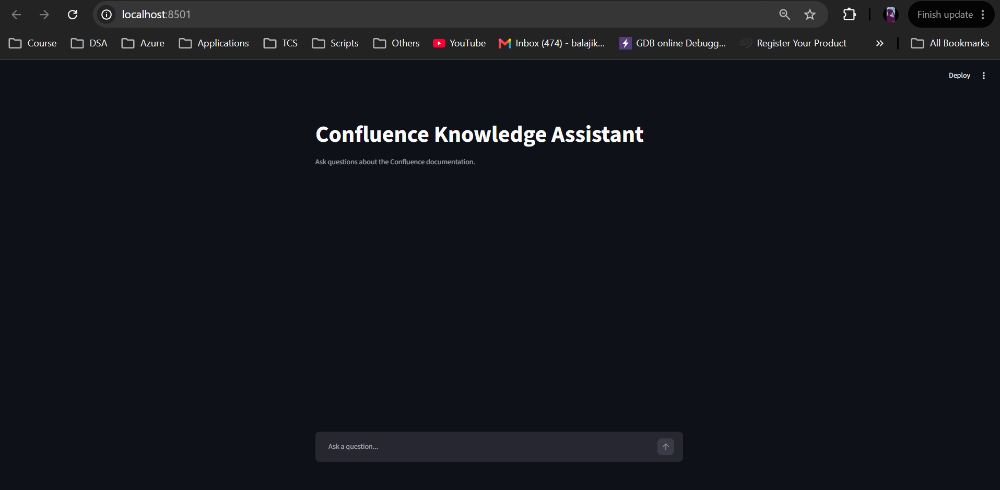

# Confluence Knowledge Assistant

A Proof of Concept (POC) for building a chatbot over Confluence documentation using **Retrieval-Augmented Generation (RAG)**.

The chatbot retrieves relevant information from a Confluence page, uses semantic search to find the most relevant content, and then uses Google Gemini to generate a grounded answer with the original Confluence page as the source.

---

## 1. Overview

This project demonstrates how Confluence documentation can be used as a knowledge base for an AI chatbot.

The POC uses:

* **Confluence Cloud** as the knowledge source
* **Confluence REST API** to retrieve page content
* **Google Gemini API** for embeddings and answer generation
* **FAISS** as a local vector database
* **Python** for the backend and RAG pipeline
* **Streamlit** for the chatbot UI

The current POC uses a single Confluence page as the knowledge source.

---

## 2. Architecture

```text
                    CONFLUENCE
                        |
                        | REST API
                        v
              +---------------------+
              |   Confluence Page   |
              +----------+----------+
                         |
                         v
              +---------------------+
              |  HTML/Text Cleaning |
              +----------+----------+
                         |
                         v
              +---------------------+
              |      Chunking       |
              +----------+----------+
                         |
                         v
              +---------------------+
              | Gemini Embeddings   |
              +----------+----------+
                         |
                         v
              +---------------------+
              |   FAISS Vector DB   |
              +----------+----------+
                         |
                         |
              USER QUESTION
                    |
                    v
          +-----------------------+
          | Gemini Embedding      |
          +-----------+-----------+
                      |
                      v
          +-----------------------+
          | FAISS Similarity      |
          | Search                |
          +-----------+-----------+
                      |
                      v
          +-----------------------+
          | Relevant Confluence   |
          | Chunks                |
          +-----------+-----------+
                      |
                      v
          +-----------------------+
          | Gemini 2.5 Flash      |
          | Answer Generation     |
          +-----------+-----------+
                      |
                      v
          +-----------------------+
          | Answer + Source URL   |
          +-----------------------+
```

---

## 3. RAG Flow

The application follows a standard Retrieval-Augmented Generation workflow.

### Ingestion

```text
Confluence Page
      |
      v
Fetch page using REST API
      |
      v
Extract HTML
      |
      v
Convert HTML to text
      |
      v
Split text into chunks
      |
      v
Generate Gemini embeddings
      |
      v
Store embeddings in FAISS
```

### Question answering

```text
User Question
      |
      v
Generate question embedding
      |
      v
Search FAISS
      |
      v
Retrieve relevant chunks
      |
      v
Send context + question to Gemini
      |
      v
Generate grounded answer
      |
      v
Display answer + Confluence source
```

---

## 4. Project Structure

```text
confluence-chatbot/
|
├── .env
├── requirements.txt
|
├── ingest.py
├── query_kb.py
├── chatbot.py
├── app.py
|
└── knowledge_base/
    ├── confluence.index
    └── metadata.pkl
```

### Files

| File                              | Purpose                                    |
| --------------------------------- | ------------------------------------------ |
| `.env`                            | Stores API credentials                     |
| `requirements.txt`                | Python dependencies                        |
| `ingest.py`                       | Retrieves and processes Confluence content |
| `query_kb.py`                     | Tests semantic retrieval                   |
| `chatbot.py`                      | Command-line RAG chatbot                   |
| `app.py`                          | Streamlit chatbot UI                       |
| `knowledge_base/confluence.index` | FAISS vector index                         |
| `knowledge_base/metadata.pkl`     | Chunk metadata and source information      |

---

## 5. Prerequisites

Install the following:

* Python 3.10+
* A Confluence Cloud account with access to the target page
* Atlassian API token
* Google AI Studio API key

---

## 6. Create the Python Environment

Create a virtual environment:

```bash
python -m venv venv
```

Activate it on Windows:

```bash
venv\Scripts\activate
```

On Linux/macOS:

```bash
source venv/bin/activate
```

---

## 7. Install Dependencies

Install the required packages:

```bash
pip install -r requirements.txt
```

The main dependencies are:

```text
google-genai
python-dotenv
faiss-cpu
streamlit
beautifulsoup4
requests
numpy
```

---

## 8. API Credentials

Create a `.env` file in the project root.

```env
CONFLUENCE_BASE_URL=https://your-company.atlassian.net
CONFLUENCE_EMAIL=your-atlassian-email
CONFLUENCE_API_TOKEN=your-atlassian-api-token

GEMINI_API_KEY=your-google-ai-studio-api-key
```

### Important

Do not commit `.env` to Git.

Add the following to `.gitignore`:

```gitignore
.env
venv/
__pycache__/
knowledge_base/
```

API keys and tokens should never be committed to source control.

---

## 9. Confluence API

The POC uses the Confluence REST API to retrieve the page.

The page used for the POC is:

```text
Standard Operating Procedure: Confluent Kafka Naming Conventions & Resource Provisioning
```

Page ID:

```text
131075
```

The page is retrieved using:

```text
/wiki/rest/api/content/{PAGE_ID}
```

with:

```text
body.storage
version
space
```

expanded.

---

## 10. Build the Knowledge Base

Run:

```bash
python ingest.py
```

The ingestion process:

1. Connects to Confluence.
2. Retrieves the configured page.
3. Extracts the HTML content.
4. Removes unnecessary HTML/editor artifacts.
5. Splits the content into chunks.
6. Generates embeddings using Gemini.
7. Creates a FAISS vector index.
8. Saves the index and metadata locally.

Example output:

```text
Fetching Confluence page...
Page: Standard Operating Procedure: Confluent Kafka Naming Conventions & Resource Provisioning
Cleaning content...
Creating chunks...
Number of chunks: 7
Generating embeddings...
Embedding chunk 1/7
Embedding chunk 2/7
Embedding chunk 3/7
Embedding chunk 4/7
Embedding chunk 5/7
Embedding chunk 6/7
Embedding chunk 7/7

Knowledge base created successfully.
Index: knowledge_base/confluence.index
Metadata: knowledge_base/metadata.pkl
```

---

## 11. Test Semantic Search

Run:

```bash
python query_kb.py
```

---

## 12. Run the Command-Line Chatbot

Run:

```bash
python chatbot.py
```

---

## 13. Run the Streamlit Chatbot

Start the web application:

```bash
streamlit run app.py
```

Streamlit will provide a local URL, typically:

```text
http://localhost:8501
```

Open the URL in a browser.

The chatbot allows users to ask questions interactively.

Example questions:

```text
What is the naming convention of topics?

What are the standard replication factor and min.insync.replicas?

How should consumer groups be named?

What is the naming convention for Schema Registry subjects?

How do I create a service account?

What RBAC role is mentioned for writing to a topic?

What are the standard production retention settings?
```

Output: 

UI



Query 1


Query 2


Query 3


Query 4


Query 5


Query 6


Query 7


Query 8


---

## 14. Grounded Responses

The chatbot is instructed to use only the retrieved Confluence content.

If the answer cannot be found in the retrieved documentation, the chatbot responds:

```text
I couldn't find this information in the
Confluence knowledge base.
```

This reduces the risk of the model inventing information that isn't present in the documentation.

Query 


---

## 15. Technologies Used

### Confluence Cloud

Acts as the source of truth for the documentation.

### Confluence REST API

Used to retrieve page content programmatically.

### Google Gemini

Used for:

* Text embeddings
* Natural-language answer generation

Models used in this POC:

```text
gemini-embedding-001
gemini-2.5-flash
```

### FAISS

FAISS provides local vector similarity search.

It allows the application to find documentation chunks that are semantically similar to a user's question.

### Streamlit

Provides the web-based chatbot interface.

---

## 16. Why FAISS?

FAISS was selected for this POC because it:

* Runs locally
* Does not require a separate database server
* Is simple to set up
* Supports vector similarity search
* Does not require additional infrastructure

For a small POC, a local FAISS index is sufficient.

---

## 17. Why RAG?

A normal LLM chatbot could answer questions using its pretrained knowledge.

However, that knowledge may not contain the organization's internal Confluence documentation.

RAG solves this by retrieving relevant internal documentation and providing it to the LLM as context.

```text
LLM Knowledge
       +
Retrieved Confluence Knowledge
       |
       v
Grounded Answer
```

The LLM therefore uses the organization's documentation when answering questions.

---

## 18. Current POC Scope

The current implementation intentionally keeps the architecture simple.

### Included

* Single Confluence page
* Confluence REST API
* Text extraction
* Basic chunking
* Gemini embeddings
* Local FAISS vector database
* Semantic retrieval
* Gemini answer generation
* Source URL
* Streamlit chatbot

### Not included

* Multiple-page crawling
* Automatic Confluence synchronization
* Production vector database
* User authentication
* Conversation persistence
* Document version management
* Automated re-indexing
* Cloud deployment
* Production monitoring
* Advanced access-control filtering

These can be considered for a production implementation.

---

## 19. POC Architecture Summary

```text
                    +----------------+
                    |  Confluence    |
                    |  Documentation |
                    +-------+--------+
                            |
                            | REST API
                            v
                    +---------------+
                    | Python        |
                    | Ingestion     |
                    +-------+-------+
                            |
                            v
                    +---------------+
                    | Chunking      |
                    +-------+-------+
                            |
                            v
                    +---------------+
                    | Gemini        |
                    | Embeddings    |
                    +-------+-------+
                            |
                            v
                    +---------------+
                    | FAISS         |
                    | Vector Store  |
                    +-------+-------+
                            |
                            |
                       User Query
                            |
                            v
                    +---------------+
                    | Query         |
                    | Embedding     |
                    +-------+-------+
                            |
                            v
                    +---------------+
                    | FAISS Search  |
                    +-------+-------+
                            |
                            v
                    +---------------+
                    | Relevant      |
                    | Context       |
                    +-------+-------+
                            |
                            v
                    +---------------+
                    | Gemini        |
                    | 2.5 Flash     |
                    +-------+-------+
                            |
                            v
                    +---------------+
                    | Answer +      |
                    | Source URL    |
                    +---------------+
```

---

## 20. Future Enhancements

If this POC is later converted into a production solution, possible enhancements include:

1. Ingesting multiple Confluence pages.
2. Automatically discovering pages from a Confluence space.
3. Incremental synchronization when pages are updated.
4. Improved document-aware chunking.
5. Metadata filtering.
6. Page-level access control.
7. Conversation memory.
8. Source citations for individual chunks.
9. A production vector database.
10. Authentication and authorization.
11. Logging and monitoring.
12. Deployment to a cloud environment.
13. Scheduled knowledge-base refresh.
14. Support for multiple Confluence spaces.
15. Document version tracking.

---

## 21. Security Considerations

Never commit the following to Git:

```text
CONFLUENCE_API_TOKEN
GEMINI_API_KEY
.env
```

Use environment variables or a proper secrets manager for credentials.

For a production implementation, access to Confluence content should also respect the permissions of the user requesting the information.

---

## 22. Disclaimer

This project is a **Proof of Concept** demonstrating a RAG-based chatbot over Confluence documentation.

The current implementation is intended for local development and demonstration and should not be considered production-ready without additional security, access control, monitoring, error handling, and scalability measures.
