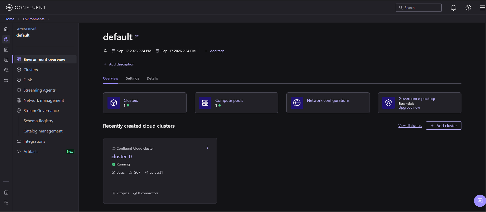
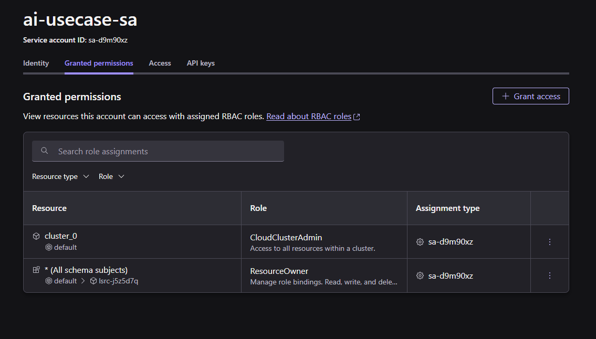
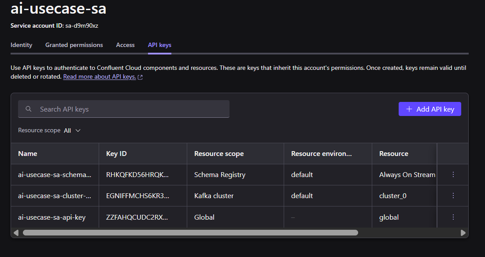
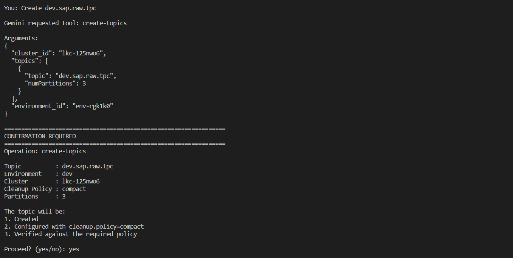
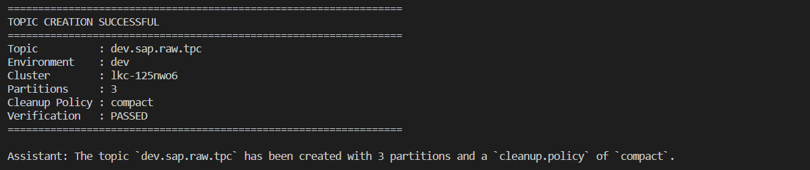
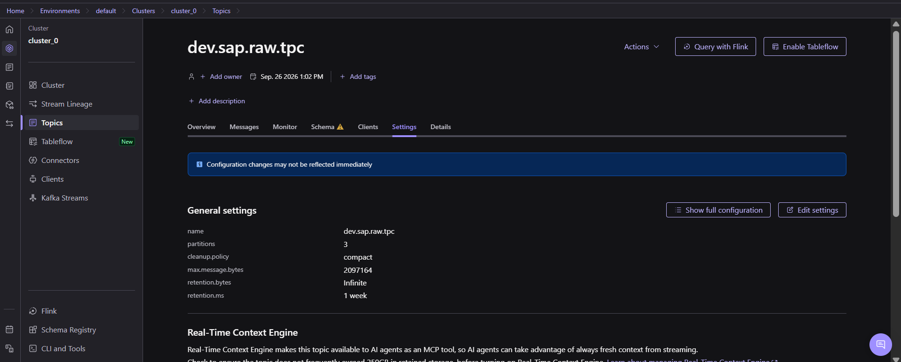
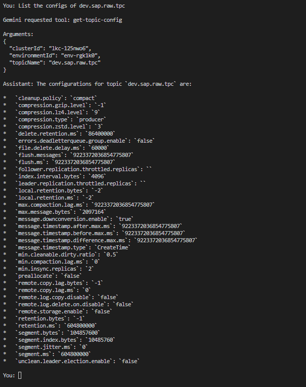
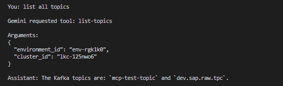

# Confluent Cloud AI Resource Management Agent

An AI-powered Confluent Cloud resource-management proof of concept using:

```text
User
  ↓
Python AI Agent
  ↓
Gemini API (Google AI Studio)
  ↓
MCP Client
  ↓
Official Confluent MCP Server
  ↓
Confluent Cloud
```

The agent uses Gemini for natural-language understanding and tool selection, while the Python layer acts as the governance/policy layer.

---

## 1. Project Goal

The goal of this POC is to allow a user to manage Confluent Cloud resources using natural language.

Examples:

```text
Create dev.sap.raw.tpc
```

```text
List the topics
```

```text
Show the configuration of dev.sap.raw.tpc
```

```text
List my connectors
```

```text
Show consumer groups
```

The AI agent translates the request into an appropriate MCP tool call.

For write operations, Python asks for confirmation before the operation is executed.

---

## 2. Architecture

```text
                         ┌──────────────────────┐
                         │        User          │
                         └──────────┬───────────┘
                                    │
                                    ▼
                         ┌──────────────────────┐
                         │    Python Agent      │
                         │                      │
                         │ Policy / Governance  │
                         │ Confirmation         │
                         └──────────┬───────────┘
                                    │
                                    ▼
                         ┌──────────────────────┐
                         │      Gemini API      │
                         │   Google AI Studio   │
                         └──────────┬───────────┘
                                    │
                                    ▼
                         ┌──────────────────────┐
                         │      MCP Client      │
                         │   Python MCP SDK     │
                         └──────────┬───────────┘
                                    │ STDIO
                                    ▼
                 ┌────────────────────────────────────┐
                 │ Official Confluent MCP Server      │
                 │                                    │
                 │ @confluentinc/mcp-confluent       │
                 └────────────────┬───────────────────┘
                                  │
                                  ▼
                       ┌──────────────────────┐
                       │   Confluent Cloud    │
                       │                      │
                       │ Kafka / Connect /    │
                       │ Schema Registry /    │
                       │ Metrics / etc.       │
                       └──────────────────────┘
```

---

# 3. Technologies Used

| Component | Technology |
|---|---|
| Programming language | Python 3.12 |
| AI model | Gemini 3.6 Flash |
| AI provider | Google AI Studio |
| MCP client | Python MCP SDK |
| MCP server | `@confluentinc/mcp-confluent` |
| Node.js | Node 24.21.0 |
| Configuration | YAML |
| Secrets | `.env` |
| Cloud platform | Confluent Cloud |
| Kafka cluster | Basic cluster |
| Cloud region | GCP `us-east1` |
| Development environment | Windows / VS Code |
| Container | Not used |

---

# 4. Prerequisites

Install:

- Python 3.12
- Node.js
- npm
- Git (optional)
- VS Code (recommended)
- A Confluent Cloud account
- A Google AI Studio API key

Verify Python:

```cmd
python --version
```

Expected:

```text
Python 3.12.x
```

Verify Node:

```cmd
node --version
```

Verify npm:

```cmd
npm --version
```

---

# 5. Project Directory

Example project directory:

```text
D:\JLR\AI USECASE
```

Recommended structure:

```text
AI USECASE/
│
├── .env
├── .gitignore
├── config.yaml
├── agent.py
├── mcp_test.py
├── check_service_accounts.py
├── test_gemini.py
├── package.json
├── package-lock.json
└── README.md
```

Do not commit `.env`.

---

# 6. Create Python Virtual Environment

From the project directory:

```cmd
python -m venv .venv
```

Activate:

```cmd
.venv\Scripts\activate
```

You should see:

```text
(.venv) D:\JLR\AI USECASE>
```

---

# 7. Install Python Dependencies

Install the Gemini SDK:

```cmd
pip install google-genai
```

Install MCP:

```cmd
pip install mcp
```

Install dotenv:

```cmd
pip install python-dotenv
```

Optional Kafka client used during connectivity testing:

```cmd
pip install confluent-kafka
```

---

# 8. Install Node Dependency

The official Confluent MCP server is executed through `npx`.

Install `dotenv-cli`:

```cmd
npm install --save-dev dotenv-cli
```

The MCP server itself is invoked through:

```cmd
npx @confluentinc/mcp-confluent
```

---

# 9. Confluent Cloud Setup

The POC uses:

```text
Environment:
default

Environment ID:
env-rgk1k0
```

Kafka cluster:

```text
cluster_0

Cluster ID:
lkc-125nwo6

Region:
GCP us-east1
```

The cluster is a Basic Kafka cluster.

Cloud Setup



---

# 10. Confluent Credentials

The setup uses three types of credentials.

## 10.1 Kafka API credentials

Used by the MCP server to communicate with Kafka.

Example environment variables:

```env
KAFKA_BOOTSTRAP_SERVER=...
KAFKA_API_KEY=...
KAFKA_API_SECRET=...
KAFKA_REST_ENDPOINT=...
KAFKA_CLUSTER_ID=lkc-125nwo6
KAFKA_ENV_ID=env-rgk1k0
```

## 10.2 Schema Registry credentials

```env
SCHEMA_REGISTRY_ENDPOINT=...
SCHEMA_REGISTRY_API_KEY=...
SCHEMA_REGISTRY_API_SECRET=...
```

## 10.3 Confluent Cloud API credentials

```env
CONFLUENT_CLOUD_API_KEY=...
CONFLUENT_CLOUD_API_SECRET=...
```

These are used by the configured Confluent Cloud connection.

Service Account created for authenticating into Confluent


API Keys created with respect to the SA


## 10.4 Gemini

```env
GEMINI_API_KEY=...
```

Never commit these credentials.

---

# 11. Example `.env`

Do not use these as real credentials.

```env
KAFKA_BOOTSTRAP_SERVER=<kafka-bootstrap-server>
KAFKA_API_KEY=<kafka-api-key>
KAFKA_API_SECRET=<kafka-api-secret>

KAFKA_REST_ENDPOINT=<kafka-rest-endpoint>
KAFKA_CLUSTER_ID=lkc-125nwo6
KAFKA_ENV_ID=env-rgk1k0

SCHEMA_REGISTRY_ENDPOINT=<schema-registry-endpoint>
SCHEMA_REGISTRY_API_KEY=<schema-registry-api-key>
SCHEMA_REGISTRY_API_SECRET=<schema-registry-api-secret>

CONFLUENT_CLOUD_API_KEY=<cloud-api-key>
CONFLUENT_CLOUD_API_SECRET=<cloud-api-secret>

GEMINI_API_KEY=<google-ai-studio-api-key>
```

---

# 12. MCP Configuration

The project uses `config.yaml`.

Example:

```yaml
server:
  transports: [stdio]
  log_level: "${LOG_LEVEL:-info}"

  http:
    port: ${HTTP_PORT:-8080}
    host: "${HTTP_HOST:-127.0.0.1}"
    mcp_endpoint: "${HTTP_MCP_ENDPOINT_PATH:-/mcp}"
    sse_endpoint: "${SSE_MCP_ENDPOINT_PATH:-/sse}"
    sse_message_endpoint: "${SSE_MCP_MESSAGE_ENDPOINT_PATH:-/messages}"

  auth:
    allowed_hosts:
      - localhost
      - "127.0.0.1"

connections:
  default:
    type: direct
    description: "Primary Confluent Cloud connection"

    kafka:
      bootstrap_servers: "${KAFKA_BOOTSTRAP_SERVER}"

      auth:
        type: api_key
        key: "${KAFKA_API_KEY}"
        secret: "${KAFKA_API_SECRET}"

      rest_endpoint: "${KAFKA_REST_ENDPOINT}"
      cluster_id: "${KAFKA_CLUSTER_ID}"
      env_id: "${KAFKA_ENV_ID}"

    schema_registry:
      endpoint: "${SCHEMA_REGISTRY_ENDPOINT}"

      auth:
        type: api_key
        key: "${SCHEMA_REGISTRY_API_KEY}"
        secret: "${SCHEMA_REGISTRY_API_SECRET}"

    confluent_cloud:
      endpoint: "https://api.confluent.cloud"

      auth:
        type: api_key
        key: "${CONFLUENT_CLOUD_API_KEY}"
        secret: "${CONFLUENT_CLOUD_API_SECRET}"
```

---

# 13. Starting the Official Confluent MCP Server

The server is launched using:

```cmd
npx dotenv -e .env -- npx @confluentinc/mcp-confluent --config ./config.yaml
```

The Python agent starts the MCP server automatically, so normally you do not need to manually start it in another terminal.

The Python application uses STDIO transport.

---

# 14. MCP Client

The Python agent uses:

```python
from mcp import ClientSession, StdioServerParameters
from mcp.client.stdio import stdio_client
```

The MCP server is started as a child process.

The client initializes the session:

```python
await mcp.initialize()
```

Then discovers available tools:

```python
result = await mcp.list_tools()
```

The tools are dynamically exposed to Gemini.

This means the Python agent does not need to hard-code every MCP tool.

---

# 15. Current MCP Tools

The current MCP server exposes 49 tools.

## Kafka Topics

### 01. `list-topics`

Lists Kafka topics.

### 02. `create-topics`

Creates Kafka topics.

### 03. `delete-topics`

Deletes Kafka topics.

### 04. `produce-message`

Produces a message to a Kafka topic.

### 05. `consume-messages`

Consumes messages from a Kafka topic.

### 06. `get-partition-offsets`

Gets partition offsets.

---

# 16. Consumer Groups

### 07. `list-consumer-groups`

Lists consumer groups.

### 08. `describe-consumer-group`

Describes a consumer group.

### 09. `get-consumer-group-lag`

Gets consumer-group lag.

---

# 17. Compute Pools

### 10. `list-compute-pools`

Lists available Confluent compute pools.

Flink/Tableflow tools were not enabled in the current configuration because the required configuration blocks were not present.

---

# 18. Connectors

### 11. `list-connectors`

Lists connectors.

### 12. `create-connector`

Creates a connector.

### 13. `delete-connector`

Deletes a connector.

### 14. `get-connector-config`

Gets connector configuration.

### 15. `get-connector-offsets`

Gets connector offsets.

### 16. `get-connector-status`

Gets connector status.

### 17. `get-connector-tasks`

Gets connector tasks.

### 18. `get-connector-error-summary`

Gets connector error summary.

### 19. `get-connector-error-recommendations`

Gets connector error recommendations.

### 20. `get-connector-logs`

Gets connector logs.

### 21. `update-connector-config`

Updates connector configuration.

### 22. `pause-connector`

Pauses a connector.

### 23. `resume-connector`

Resumes a connector.

### 24. `restart-connector`

Restarts a connector.

---

# 19. Topic Tags

### 25. `search-topics-by-tag`

Searches topics using tags.

### 26. `search-topics-by-name`

Searches topics by name.

### 27. `create-topic-tags`

Creates topic tags.

### 28. `delete-tag`

Deletes a tag.

### 29. `remove-tag-from-entity`

Removes a tag from an entity.

### 30. `add-tags-to-topic`

Adds tags to a topic.

### 31. `list-tags`

Lists tags.

---

# 20. Topic Configuration

### 32. `alter-topic-config`

Changes topic configuration.

This tool became important for the topic governance workflow because `create-topics` does not accept `cleanup.policy`.

For example:

```json
{
  "topicName": "dev.sap.raw.tpc",
  "topicConfigs": [
    {
      "name": "cleanup.policy",
      "value": "compact",
      "operation": "SET"
    }
  ],
  "validateOnly": false,
  "clusterId": "lkc-125nwo6",
  "environmentId": "env-rgk1k0"
}
```

### 39. `get-topic-config`

Gets topic configuration and is used to verify the final topic state.

---

# 21. Cluster and Environment

### 33. `list-clusters`

Lists Confluent Kafka clusters.

### 34. `list-environments`

Lists Confluent environments.

### 35. `read-environment`

Reads environment information.

---

# 22. Schema Registry

### 36. `list-schemas`

Lists schemas.

### 37. `create-schema`

Creates a schema.

### 38. `delete-schema`

Deletes a schema.

---

# 23. Billing and Metrics

### 40. `list-billing-costs`

Gets billing/cost information.

### 41. `query-metrics`

Queries available Confluent metrics.

### 42. `list-available-metrics`

Lists available metrics.

---

# 24. Confluent Documentation

### 43. `search-product-docs`

Searches Confluent product documentation.

### 44. `get-product-doc-page`

Gets a documentation page.

These tools can be useful for an AI documentation assistant.

---

# 25. Organization and MCP Configuration

### 45. `list-organizations`

Lists organizations.

### 46. `explain-disabled-tools`

Explains why tools are disabled.

### 47. `list-configured-connections`

Lists configured MCP connections.

### 48. `config-help`

Provides configuration help.

### 49. `describe-configured-connection`

Describes a configured connection.

---

# 26. Topic Governance Policy

The POC implements a strict topic naming and configuration policy.

## Naming

Every topic must follow:

```text
{environment}.{application_name}.{type}.tpc
```

Examples:

```text
dev.sap.raw.tpc
dev.sap.events.tpc
test.sap.raw.tpc
prod.sap.raw.tpc
```

Invalid:

```text
dev.sap.raw
dev.sap.raw.topic
development.sap.raw.tpc
dev.sap.raw.tpc.extra
```

---

# 27. Topic Environment Policy

The supported environments are:

```text
dev
test
prod
```

Configuration:

| Environment | Cleanup Policy | Partitions |
|---|---|---:|
| dev | compact | 3 |
| test | compact | 3 |
| prod | compact | 6 |

The user cannot override these values.

For example:

```text
Create prod.sap.raw.tpc with 3 partitions
```

will still result in:

```text
prod.sap.raw.tpc
partitions = 6
cleanup.policy = compact
```

The Python layer is authoritative.

---

# 28. Topic Creation Workflow

Topic creation follows:

```text
User request
    ↓
Gemini identifies create-topics operation
    ↓
Python intercepts create-topics
    ↓
Validate topic name
    ↓
Extract environment
    ↓
Apply mandatory policy
    ↓
Ask for confirmation
    ↓
create-topics
    ↓
alter-topic-config
    ↓
get-topic-config
    ↓
Verify
```

The operation is a multi-step workflow, not an atomic transaction.

---

# 29. Topic Confirmation

Example:

```text
CONFIRMATION REQUIRED

Operation: create-topics

Topic          : dev.sap.raw.tpc
Environment    : dev
Cluster        : lkc-125nwo6
Cleanup Policy : compact
Partitions     : 3

The topic will be:
1. Created
2. Configured with cleanup.policy=compact
3. Verified against the required policy

Proceed? (yes/no):
```

The confirmation is handled by Python.

Gemini is explicitly instructed not to ask the user for confirmation.

---

# 30. Why Python Handles Policy

Gemini is responsible for:

- Understanding natural language
- Selecting tools
- Supplying tool arguments
- Explaining results

Python is responsible for:

- Validation
- Governance
- Confirmation
- Mandatory configuration
- Security boundaries
- Resource-policy enforcement

This prevents the model from overriding mandatory infrastructure rules.

The architecture is therefore:

```text
Gemini = intelligence / tool selection

Python = governance / policy enforcement

MCP = Confluent resource interface
```

---

# 31. All MCP Tools Are Exposed to Gemini

The Python application dynamically obtains:

```python
mcp.list_tools()
```

and converts every discovered MCP tool into a Gemini function declaration.

Therefore:

```text
Available MCP tools: 49
Tools exposed to Gemini: 49
```

The agent does not expose only a small hard-coded subset.

---

# 32. Write Operations

The current Python policy treats these operations as writes:

```text
create-topics
delete-topics
produce-message
create-connector
delete-connector
update-connector-config
pause-connector
resume-connector
restart-connector
create-schema
delete-schema
alter-topic-config
create-topic-tags
delete-tag
remove-tag-from-entity
add-tags-to-topic
```

These require Python-controlled confirmation.

---

# 33. Read Operations

Read operations execute without confirmation.

Examples:

```text
list-topics
get-topic-config
list-clusters
list-environments
list-connectors
get-connector-status
list-consumer-groups
get-consumer-group-lag
list-schemas
query-metrics
```

---

# 34. Service Account / RBAC Investigation

Service-account provisioning was investigated as a possible next capability.

The desired naming convention is:

## Producer

```text
{application_name}-{env}-prd-sa
```

Example:

```text
sap-dev-prd-sa
```

## Consumer

```text
{application_name}-{env}-csm-sa
```

Example:

```text
sap-dev-csm-sa
```

The desired workflow would be:

```text
Create producer service account
        ↓
sap-dev-prd-sa
        ↓
Assign appropriate permissions/RBAC
```

and:

```text
Create consumer service account
        ↓
sap-dev-csm-sa
        ↓
Assign appropriate permissions/RBAC
```

However, the current MCP server does not expose service-account or IAM/RBAC tools.

---

# 35. Current MCP Limitation for Service Accounts

The complete list of currently exposed tools was inspected.

There are no tools such as:

```text
create-service-account
list-service-accounts
delete-service-account
create-role-binding
list-role-bindings
delete-role-binding
```

Therefore the current MCP server cannot perform service-account creation or RBAC role-binding management through the current 49-tool interface.

The current requirement remains:

```text
Gemini
   ↓
MCP
   ↓
Confluent Cloud
```

with no direct REST/CLI calls from Python.

For the POC, service-account/RBAC provisioning should therefore remain outside the current implementation until an appropriate MCP capability is available or the official MCP server is extended.

---

# 36. MCP Connectivity Test

A separate `mcp_test.py` can be used to verify connectivity.

The basic process is:

```python
await mcp.initialize()
result = await mcp.list_tools()
```

Successful output:

```text
Connected to Confluent MCP Server
Available MCP tools: 49
```

---

# 37. Gemini Connectivity Test

A simple Gemini test can be performed with:

```python
import os

from dotenv import load_dotenv
from google import genai

load_dotenv()

client = genai.Client(
    api_key=os.getenv("GEMINI_API_KEY")
)

response = client.models.generate_content(
    model="gemini-3.6-flash",
    contents="Say hello in one sentence."
)

print(response.text)
```

---

# 38. Gemini Model and Quota

The POC uses:

```text
gemini-3.6-flash
```

Google AI Studio free-tier quota was encountered during testing.

Example error:

```text
429 RESOURCE_EXHAUSTED
```

This is a Gemini API quota issue and is independent of Confluent MCP.

If the Gemini quota is exhausted, MCP itself can still be healthy; the AI layer simply cannot obtain a new model response until quota becomes available.

---

# 39. Important Gemini/MCP Implementation Detail

The Gemini SDK's built-in MCP/AFC integration caused an issue involving:

```text
TypeError: cannot pickle '_asyncio.Task' object
```

Therefore the POC uses:

```text
Gemini function calling
        ↓
Python
        ↓
MCP tool execution
        ↓
Result returned to Gemini
```

instead of relying on Gemini's automatic MCP execution.

This also provides a convenient location for governance and confirmation.

---

# 40. Function Name Conversion

MCP tool names contain hyphens:

```text
create-topics
get-topic-config
list-consumer-groups
```

Gemini function declarations use underscores:

```text
create_topics
get_topic_config
list_consumer_groups
```

The Python agent converts between the two:

```python
tool.name.replace("-", "_")
```

and:

```python
function_name.replace("_", "-")
```

---

# 41. Basic Test Cases

## Test 1 — Create dev topic

```text
Create dev.sap.raw.tpc
```

Expected policy:

```text
cleanup.policy = compact
partitions = 3
```
Create topic using mcp server






---

## Test 2 — Create test topic

```text
Create test.sap.raw.tpc
```

Expected:

```text
cleanup.policy = compact
partitions = 3
```

---

## Test 3 — Create prod topic

```text
Create prod.sap.raw.tpc
```

Expected:

```text
cleanup.policy = compact
partitions = 6
```

---

## Test 4 — Invalid topic name

```text
Create dev.sap.raw
```

Expected:

```text
TOPIC POLICY ERROR
```

Tried creating a topic with wrong naming convention


---

## Test 5 — Read topic configuration

```text
List the configs of dev.sap.raw.tpc
```

The agent should call:

```text
get-topic-config
```

and return the actual configuration.

Fetch topic configs


---

## Test 6 — List topics

```text
List all topics
```

Expected MCP tool:

```text
list-topics
```

List down all topics



---

# 42. Running the Agent

Activate the environment:

```cmd
.venv\Scripts\activate
```

Run:

```cmd
python agent.py
```

Expected startup:

```text
Connected to Confluent MCP Server

Available MCP tools: 49
Tools exposed to Gemini: 49

Topic creation policy:
  dev  -> compact / 3 partitions
  test -> compact / 3 partitions
  prod -> compact / 6 partitions

Cluster: lkc-125nwo6
Environment: env-rgk1k0

All write operations require confirmation.

Type 'exit' to quit.
```

---

# 43. Example End-to-End Topic Creation

User:

```text
Create dev.sap.raw.tpc
```

Gemini requests:

```text
create-topics
```

Python applies:

```text
environment = dev
partitions = 3
cleanup.policy = compact
cluster = lkc-125nwo6
environment_id = env-rgk1k0
```

Python asks:

```text
Proceed? (yes/no):
```

User:

```text
yes
```

Python executes:

```text
create-topics
```

Then:

```text
alter-topic-config
```

Then:

```text
get-topic-config
```

Finally:

```text
Verification: PASSED
```

---

# 44. Security Considerations

Never commit:

```text
.env
```

Add to `.gitignore`:

```gitignore
.env
.venv/
__pycache__/
*.pyc
node_modules/
```

Credentials should never be hard-coded into:

- `agent.py`
- `config.yaml`
- README files
- Git repositories
- logs

Use environment variables.

---

# 45. Current Resource Model

The current POC operates against:

```text
Confluent Environment:
env-rgk1k0

Kafka Cluster:
lkc-125nwo6

Region:
GCP us-east1
```

The logical application environments:

```text
dev
test
prod
```

are represented in the resource naming convention.

They are not separate Confluent Cloud environments in this POC.

For example:

```text
dev.sap.raw.tpc
```

and:

```text
prod.sap.raw.tpc
```

can use the same Confluent Cloud cluster while being distinguished by the logical environment prefix.

---

# 46. Design Principles

The POC follows these principles:

### 1. Natural language interface

The user does not need to know MCP tool names.

### 2. Dynamic tool discovery

The agent discovers MCP tools at startup.

### 3. Python policy enforcement

Infrastructure rules are not delegated entirely to the AI model.

### 4. Confirmation before writes

Destructive or state-changing operations require explicit confirmation.

### 5. Real resource operations

The agent uses actual Confluent MCP tools rather than simulated results.

### 6. Verification

Important resource creation workflows verify the final resource state.

### 7. No Docker

The current implementation runs directly on Windows using Python and Node.js.

---

# 47. Current Limitations

1. Service-account creation is not available through the current 49 MCP tools.

2. RBAC/IAM role-binding management is not available through the current 49 MCP tools.

3. Flink/Tableflow tools are disabled because they are not configured in the current MCP connection.

4. Gemini free-tier quota can limit the number of model requests.

5. Topic creation is a multi-step workflow rather than an atomic transaction.

6. If topic creation succeeds but policy configuration fails, the topic can remain partially configured.

7. The POC currently uses one Confluent Cloud Kafka cluster.

---

# 48. Future Enhancements

Potential next steps:

```text
1. Service Account provisioning
2. RBAC role binding through MCP
3. Producer/Consumer permission policies
4. Connector governance
5. Schema governance
6. Topic existence/idempotency checks
7. Automatic rollback for failed provisioning
8. Audit logging
9. Resource tagging policies
10. Environment-specific governance
11. Approval workflows
12. Better structured verification
13. MCP IAM/RBAC extension
14. Web UI
```

---

# 49. Target Future Architecture

If IAM/RBAC tools become available in the MCP layer:

```text
                           User
                             │
                             ▼
                     ┌───────────────┐
                     │  Gemini AI    │
                     └───────┬───────┘
                             │
                             ▼
                     ┌───────────────┐
                     │  MCP Client   │
                     └───────┬───────┘
                             │
                             ▼
                ┌─────────────────────────┐
                │ Confluent MCP Server    │
                │                         │
                │ Kafka                   │
                │ Connect                 │
                │ Schema Registry         │
                │ IAM / RBAC              │
                └────────────┬────────────┘
                             │
                             ▼
                    Confluent Cloud
```

Then a complete application onboarding flow could become:

```text
Create application
        │
        ├── Create topic
        │
        ├── Configure topic
        │
        ├── Verify topic
        │
        ├── Create producer SA
        │
        ├── Create consumer SA
        │
        ├── Assign producer permissions
        │
        └── Assign consumer permissions
```

---

# 50. Summary

This POC demonstrates an AI-driven Confluent Cloud management architecture:

```text
User
 ↓
Gemini
 ↓
Python governance layer
 ↓
MCP client
 ↓
Official Confluent MCP server
 ↓
Confluent Cloud
```

The current implementation dynamically exposes all 49 MCP tools to Gemini.

The most important governance rule is that **Gemini does not have authority to override infrastructure policy**.

For topics:

```text
dev  → compact + 3
test → compact + 3
prod → compact + 6
```

The Python layer validates the topic name, derives the mandatory configuration, requests confirmation, creates the topic, configures the cleanup policy, and verifies the final state.

The current MCP server does not expose service-account or RBAC/IAM operations, so those capabilities have not been added through direct REST/CLI calls. The intended long-term architecture is to keep resource provisioning behind MCP so that the complete flow remains:

```text
Gemini → MCP → Confluent Cloud
```
